# User Flow & Sitemap

This document provides a visual representation of the Create Spot application's sitemap and user navigation flows. It shows how users move between pages and the relationships between different sections of the application.

## Sitemap Diagram

The following diagram illustrates all pages in the application and how they connect to each other:

```mermaid
flowchart TD
    %% Entry Points
    Home["/ (Home)"]
    SignIn["/auth/signin (Sign In)"]
    
    %% Exhibits Section
    ExhibitsHome["/exhibition (Exhibits Home)"]
    Gallery["/exhibition/gallery (Gallery)"]
    Constellation["/exhibition/constellation (Constellation)"]
    Global["/exhibition/global (Global Map)"]
    
    %% Prompts/Inspire Section
    PromptsAbout["/prompt (Prompts About)"]
    PromptsPlay["/prompt/play (Create Submission)"]
    PromptsHistory["/prompt/history (User History)"]
    PromptsThisWeek["/prompt/this-week (This Week Gallery)"]
    
    %% About Section
    AboutHome["/about (About Home)"]
    AboutPurpose["/about/purpose (Purpose)"]
    AboutPortfolios["/about/portfolios-and-sharing (Portfolios & Sharing)"]
    AboutSubmissions["/about/prompt-submissions (Prompt Submissions)"]
    
    %% User Pages
    UserProfile["/profile/[userId] (User Profile)"]
    EditProfile["/profile/edit (Edit Profile)"]
    UserPortfolio["/portfolio/[userId] (User Portfolio)"]
    EditPortfolio["/portfolio/edit (Edit Portfolio)"]
    Favorites["/favorites (Favorites)"]
    
    %% Admin Pages
    AdminPrompts["/admin (Manage Prompts)"]
    AdminUsers["/admin/users (Manage Users)"]
    
    %% Dynamic Routes
    SubmissionDetail["/s/[id] (Submission Detail)"]
    
    %% Entry Point Connections
    Home --> ExhibitsHome
    Home --> PromptsAbout
    Home --> AboutHome
    Home --> SignIn
    Home --> SubmissionDetail
    Home --> UserProfile
    Home --> UserPortfolio
    
    %% Exhibits Flow
    ExhibitsHome --> Gallery
    ExhibitsHome --> Constellation
    ExhibitsHome --> Global
    Gallery --> SubmissionDetail
    Constellation --> SubmissionDetail
    Global --> SubmissionDetail
    
    %% Prompts Flow
    PromptsAbout --> PromptsPlay
    PromptsAbout --> PromptsHistory
    PromptsAbout --> PromptsThisWeek
    PromptsPlay --> SubmissionDetail
    PromptsHistory --> SubmissionDetail
    PromptsThisWeek --> SubmissionDetail
    
    %% About Flow
    AboutHome --> AboutPurpose
    AboutHome --> AboutPortfolios
    AboutHome --> AboutSubmissions
    
    %% User Flow
    SignIn --> PromptsPlay
    SignIn --> EditProfile
    SignIn --> EditPortfolio
    SignIn --> Favorites
    UserProfile --> EditProfile
    UserProfile --> UserPortfolio
    UserPortfolio --> EditPortfolio
    UserProfile --> SubmissionDetail
    UserPortfolio --> SubmissionDetail
    
    %% Submission Detail Connections
    SubmissionDetail --> UserProfile
    SubmissionDetail --> UserPortfolio
    
    %% Admin Flow
    AdminPrompts --> AdminUsers
    
    %% Styling for authentication requirements
    classDef authenticated fill:#fff3cd,stroke:#ffc107,stroke-width:2px,color:#000
    classDef admin fill:#f8d7da,stroke:#dc3545,stroke-width:2px,color:#000
    classDef public fill:#d1ecf1,stroke:#0c5460,stroke-width:2px,color:#000
    
    class PromptsPlay,EditProfile,EditPortfolio,Favorites,PromptsHistory authenticated
    class AdminPrompts,AdminUsers admin
    class Home,SignIn,ExhibitsHome,Gallery,Constellation,Global,PromptsAbout,PromptsThisWeek,AboutHome,AboutPurpose,AboutPortfolios,AboutSubmissions,UserProfile,UserPortfolio,SubmissionDetail public
```

## Navigation Sections

### Exhibits Section

The Exhibits section provides three different ways to explore community work:

- **Exhibits Home** (`/exhibition`) - Landing page with links to all exhibit types
- **Gallery** (`/exhibition/gallery`) - Browseable grid view with filters
- **Constellation** (`/exhibition/constellation`) - Interactive 3D visualization
- **Global Map** (`/exhibition/global`) - Geographic view of artists worldwide

All exhibit pages link to individual submission detail pages.

### Inspire/Prompts Section

The Prompts section guides users through the weekly creative challenge:

- **Prompts About** (`/prompt`) - Introduction to the weekly prompt system
- **Play** (`/prompt/play`) - Create and submit work for the current prompt (authenticated only)
- **History** (`/prompt/history`) - View user's past submissions (authenticated only)
- **This Week Gallery** (`/prompt/this-week`) - Browse all submissions for the current week

### About Section

Informational pages about the platform:

- **About Home** (`/about`) - Main about page
- **Purpose** (`/about/purpose`) - Platform mission and values
- **Portfolios & Sharing** (`/about/portfolios-and-sharing`) - Information about portfolio features
- **Prompt Submissions** (`/about/prompt-submissions`) - How prompt submissions work

### User Section

Personal pages for authenticated users:

- **User Profile** (`/profile/[userId]`) - Public profile view (any user)
- **Edit Profile** (`/profile/edit`) - Edit own profile (authenticated only)
- **User Portfolio** (`/portfolio/[userId]`) - Public portfolio view (any user)
- **Edit Portfolio** (`/portfolio/edit`) - Edit own portfolio (authenticated only)
- **Favorites** (`/favorites`) - User's favorited submissions (authenticated only)

### Admin Section

Administrative pages for managing the platform:

- **Manage Prompts** (`/admin`) - Create and manage weekly prompts
- **Manage Users** (`/admin/users`) - View and manage user accounts

### Dynamic Routes

- **Submission Detail** (`/s/[id]`) - Individual submission page, accessible from:
  - Home page (Recent Work section)
  - All exhibit views
  - Prompt galleries
  - User profiles and portfolios
  - Links to creator's profile and portfolio

## Access Restrictions

### Public Pages
All users (including unauthenticated) can access:
- Home, Sign In
- All Exhibits pages
- Prompts About and This Week Gallery
- All About pages
- User profiles and portfolios (viewing)
- Submission detail pages

### Authenticated Pages
Require user to be signed in:
- `/prompt/play` - Create submissions
- `/prompt/history` - View own submission history
- `/profile/edit` - Edit own profile
- `/portfolio/edit` - Edit own portfolio
- `/favorites` - View own favorites

### Admin Pages
Require admin privileges:
- `/admin` - Manage prompts
- `/admin/users` - Manage users

## Key User Flows

### New User Flow
1. Land on **Home** page
2. Browse **Recent Work** or explore **Exhibits**
3. Click **Sign In** to create account
4. After sign in, access **Play** to create first submission
5. View submission in **History** or **This Week Gallery**

### Creating Submission Flow
1. Navigate to **Prompts About** or **Play**
2. Click **Start Creating** or go directly to **Play**
3. Create submission with image/text
4. Submission appears in **History** and **This Week Gallery**
5. Others can view it in **Exhibits** and **Submission Detail**

### Exploring Work Flow
1. Start from **Home** or any **Exhibit** view
2. Click on any submission thumbnail
3. View **Submission Detail** page
4. Click creator name to view **User Profile**
5. From profile, navigate to **User Portfolio**
6. Favorite submissions to save to **Favorites** page

### Profile Management Flow
1. Access **User Dropdown** in header (when authenticated)
2. Select **View Profile** or **View Portfolio**
3. Click **Edit** button to modify
4. Update profile information or portfolio items
5. Changes reflected immediately
