# User Flow & Sitemap

This document provides a visual representation of the Create Spot application's sitemap and user navigation flows. It shows how users move between pages and the relationships between different sections of the application.

## Sitemap Diagram

The following block diagram illustrates the hierarchical structure of all pages in the application, organized by major sections:

```mermaid
flowchart TB
    subgraph Home[" "]
        HomePage["/ (Home)"]
    end
    
    subgraph Exhibition["Exhibition"]
        ExhibitionHome["/exhibition<br/>(Home)"]
        GalleryGrid["/exhibition/gallery/grid<br/>(Grid View)"]
        Constellation["/exhibition/gallery/path<br/>(Constellation)"]
        GlobalMap["/exhibition/global<br/>(Map View)"]
        ExhibitDetail["/exhibition/[exhibitId]<br/>(Exhibit Detail)"]
    end
    
    subgraph Prompts["Prompts"]
        PromptsAbout["/prompt<br/>(About)"]
        PromptsPlay["/prompt/play<br/>(Create Submission) 🔒"]
        PromptsHistory["/prompt/history<br/>(User History) 🔒"]
        PromptsThisWeek["/prompt/this-week<br/>(This Week Gallery)"]
    end
    
    subgraph About["About"]
        AboutHome["/about<br/>(Home)"]
        AboutPurpose["/about/purpose<br/>(Purpose)"]
        AboutFeatures["/about/features<br/>(Features)"]
        AboutPortfolios["/about/portfolios-and-sharing<br/>(Portfolios & Sharing)"]
        AboutSubmissions["/about/prompt-submissions<br/>(Prompt Submissions)"]
        AboutBadges["/about/badges<br/>(Badges)"]
        AboutProtecting["/about/protecting-your-work<br/>(Protecting Your Work)"]
    end
    
    subgraph Profile["Profile & Portfolio"]
        UserProfile["/profile/[userId]<br/>(User Profile)"]
        EditProfile["/profile/edit<br/>(Edit Profile) 🔒"]
        UserPortfolio["/portfolio/[userId]<br/>(User Portfolio)"]
        EditPortfolio["/portfolio/edit<br/>(Edit Portfolio) 🔒"]
        MyCollections["/collections<br/>(My Collections) 🔒"]
        UserCollections["/portfolio/[userId]/collections<br/>(User Collections)"]
        CollectionDetail["/portfolio/[userId]/collections/[collectionId]<br/>(Collection Detail)"]
        CollectionEdit["/portfolio/[userId]/collections/[collectionId]/edit<br/>(Edit Collection) 🔒"]
    end
    
    subgraph Admin["Admin"]
        AdminHome["/admin<br/>(Dashboard)"]
        AdminPrompts["/admin/prompts<br/>(Manage Prompts)"]
        AdminUsers["/admin/users<br/>(Manage Users)"]
        AdminExhibits["/admin/exhibits<br/>(Manage Exhibits)"]
        AdminExhibitsNew["/admin/exhibits/new<br/>(New Exhibit)"]
        AdminExhibitsEdit["/admin/exhibits/[id]/edit<br/>(Edit Exhibit)"]
        AdminExhibitsContent["/admin/exhibits/[id]/content<br/>(Exhibit Content)"]
        AdminNotifications["/admin/notifications<br/>(Notifications)"]
    end
    
    subgraph Other["Other Pages"]
        Creators["/creators<br/>(Creators)"]
        Favorites["/favorites<br/>(Favorites) 🔒"]
        Contact["/contact<br/>(Contact)"]
        Terms["/terms<br/>(Terms)"]
        SignIn["/auth/signin<br/>(Sign In)"]
    end
    
    subgraph Dynamic["Dynamic Routes"]
        SubmissionDetail["/s/[id]<br/>(Submission Detail)"]
        SubmissionEdit["/s/[id]/edit<br/>(Edit Submission) 🔒"]
        ImageEditor["/s/[id]/tools/image-editor<br/>(Image Editor) 🔒"]
    end
    
    %% Styling
    style PromptsPlay fill:#00000,stroke:#ffc107,stroke-width:2px
    style PromptsHistory fill:#00000,stroke:#ffc107,stroke-width:2px
    style EditProfile fill:#00000,stroke:#ffc107,stroke-width:2px
    style EditPortfolio fill:#00000,stroke:#ffc107,stroke-width:2px
    style MyCollections fill:#00000,stroke:#ffc107,stroke-width:2px
    style CollectionEdit fill:#00000,stroke:#ffc107,stroke-width:2px
    style Favorites fill:#00000,stroke:#ffc107,stroke-width:2px
    style SubmissionEdit fill:#00000,stroke:#ffc107,stroke-width:2px
    style ImageEditor fill:#00000,stroke:#ffc107,stroke-width:2px
    
    style AdminHome fill:#00000,stroke:#dc3545,stroke-width:2px
    style AdminPrompts fill:#00000,stroke:#dc3545,stroke-width:2px
    style AdminUsers fill:#00000,stroke:#dc3545,stroke-width:2px
    style AdminExhibits fill:#00000,stroke:#dc3545,stroke-width:2px
    style AdminExhibitsNew fill:#00000,stroke:#dc3545,stroke-width:2px
    style AdminExhibitsEdit fill:#00000,stroke:#dc3545,stroke-width:2px
    style AdminExhibitsContent fill:#00000,stroke:#dc3545,stroke-width:2px
    style AdminNotifications fill:#00000a,stroke:#dc3545,stroke-width:2px
```

**Legend:**
- 🔒 = Requires authentication
- Yellow background = Authenticated pages
- Red background = Admin-only pages
- Blue background = Public pages

## Navigation Sections

### Exhibits Section

The Exhibits section provides multiple ways to explore community work:

- **Exhibits Home** (`/exhibition`) - Landing page with links to all exhibit types
- **Grid View** (`/exhibition/gallery/grid`) - Browseable grid view with filters
- **Constellation** (`/exhibition/gallery/path`) - Interactive 3D visualization
- **Map View** (`/exhibition/global`) - Geographic view of artists worldwide
- **Exhibit Detail** (`/exhibition/[exhibitId]`) - View specific exhibit with submissions

All exhibit pages link to individual submission detail pages.

### Inspire/Prompts Section

The Prompts section guides users through the weekly creative challenge:

- **Prompts About** (`/prompt`) - Introduction to the weekly prompt system
- **Play** (`/prompt/play`) - Create and submit work for the current prompt (authenticated only)
- **History** (`/prompt/history`) - View user's past submissions (authenticated only)
- **This Week Gallery** (`/prompt/this-week`) - Browse all submissions for the current week

### About Section

Informational pages about the platform:

- **About Home** (`/about`) - Main about page
- **Purpose** (`/about/purpose`) - Platform mission and values
- **Features** (`/about/features`) - Platform features overview
- **Portfolios & Sharing** (`/about/portfolios-and-sharing`) - Information about portfolio features
- **Prompt Submissions** (`/about/prompt-submissions`) - How prompt submissions work
- **Badges** (`/about/badges`) - Information about achievement badges
- **Protecting Your Work** (`/about/protecting-your-work`) - Creator protections and rights

### User Section

Personal pages for authenticated users:

- **User Profile** (`/profile/[userId]`) - Public profile view (any user)
- **Edit Profile** (`/profile/edit`) - Edit own profile (authenticated only)
- **User Portfolio** (`/portfolio/[userId]`) - Public portfolio view (any user)
- **Edit Portfolio** (`/portfolio/edit`) - Edit own portfolio (authenticated only)
- **My Collections** (`/collections`) - Manage your collections (authenticated only)
- **User Collections** (`/portfolio/[userId]/collections`) - View user's collections (public collections only for non-owners)
- **Collection Detail** (`/portfolio/[userId]/collections/[collectionId]`) - View specific collection
- **Edit Collection** (`/portfolio/[userId]/collections/[collectionId]/edit`) - Edit collection (owner only)
- **Favorites** (`/favorites`) - User's favorited submissions (authenticated only)

### Admin Section

Administrative pages for managing the platform:

- **Admin Dashboard** (`/admin`) - Main admin dashboard
- **Manage Prompts** (`/admin/prompts`) - Create and manage weekly prompts
- **Manage Users** (`/admin/users`) - View and manage user accounts
- **Manage Exhibits** (`/admin/exhibits`) - Create and manage exhibits
- **New Exhibit** (`/admin/exhibits/new`) - Create a new exhibit
- **Edit Exhibit** (`/admin/exhibits/[id]/edit`) - Edit exhibit details
- **Exhibit Content** (`/admin/exhibits/[id]/content`) - Manage exhibit submissions
- **Notifications** (`/admin/notifications`) - Manage system notifications

### Dynamic Routes

- **Submission Detail** (`/s/[id]`) - Individual submission page, accessible from:
  - Home page (Recent Work section)
  - All exhibit views
  - Prompt galleries
  - User profiles and portfolios
  - Links to creator's profile and portfolio
- **Edit Submission** (`/s/[id]/edit`) - Edit submission (owner only, authenticated)
- **Image Editor** (`/s/[id]/tools/image-editor`) - Advanced image editing tools (owner only, authenticated)

## Access Restrictions

### Public Pages
All users (including unauthenticated) can access:
- Home, Sign In
- All Exhibits pages
- Prompts About and This Week Gallery
- All About pages
- User profiles and portfolios (viewing)
- User collections (public collections only)
- Collection detail pages (public collections only)
- Submission detail pages
- Creators page
- Contact page
- Terms page

### Authenticated Pages
Require user to be signed in:
- `/prompt/play` - Create submissions
- `/prompt/history` - View own submission history
- `/profile/edit` - Edit own profile
- `/portfolio/edit` - Edit own portfolio
- `/collections` - Manage your collections
- `/portfolio/[userId]/collections/[collectionId]/edit` - Edit collection (owner only)
- `/favorites` - View own favorites
- `/s/[id]/edit` - Edit submission (owner only)
- `/s/[id]/tools/image-editor` - Image editor (owner only)

### Admin Pages
Require admin privileges:
- `/admin` - Admin dashboard
- `/admin/prompts` - Manage prompts
- `/admin/users` - Manage users
- `/admin/exhibits` - Manage exhibits
- `/admin/exhibits/new` - Create new exhibit
- `/admin/exhibits/[id]/edit` - Edit exhibit
- `/admin/exhibits/[id]/content` - Manage exhibit content
- `/admin/notifications` - Manage notifications

## Key User Flows

### New User Flow
1. Land on **Home** page
2. Browse **Recent Work** or explore **Exhibits**
3. Click **Sign In** to create account
4. After sign in, access **Play** to create first submission
5. View submission in **History** or **This Week Gallery**

### Creating Submission Flow
1. Navigate to **Prompts About** or **Play**
2. Click **Start Creating** or go directly to **Play**
3. Create submission with image/text
4. Submission appears in **History** and **This Week Gallery**
5. Others can view it in **Exhibits** and **Submission Detail**

### Exploring Work Flow
1. Start from **Home** or any **Exhibit** view
2. Click on any submission thumbnail
3. View **Submission Detail** page
4. Click creator name to view **User Profile**
5. From profile, navigate to **User Portfolio**
6. Favorite submissions to save to **Favorites** page

### Profile Management Flow
1. Access **User Dropdown** in header (when authenticated)
2. Select **View Profile** or **View Portfolio**
3. Click **Edit** button to modify
4. Update profile information or portfolio items
5. Changes reflected immediately
